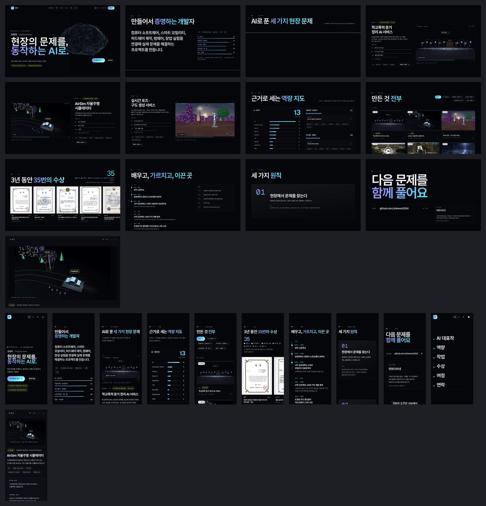

# Figma로 가져가기

지금 사이트의 디자인을 **Figma에서 바로 편집할 수 있는 형태**로 내보낸 폴더입니다.
스크린샷이 아니라 SVG 레이어입니다 — 글자는 글자 레이어, 카드 · 버튼 · 칩은 사각형 레이어,
그라디언트 헤드라인은 그라디언트 채우기로 들어갑니다.



## 넣는 법

1. Figma에서 새 디자인 파일을 엽니다.
2. `desktop/` · `mobile/` 의 SVG 파일들을 전부 선택해 캔버스로 **드래그 앤 드롭**합니다.
   파일마다 프레임 하나가 됩니다(메뉴 **File → Place image** 로도 넣을 수 있습니다).
3. `design-system.svg` 도 같은 방법으로 — 색 · 타입 · 컴포넌트 보드입니다.
4. 폰트는 Geist · Geist Mono · Noto Sans KR · Instrument Serif. 전부 Google Fonts라 Figma에서
   따로 설치할 필요가 없습니다. 레이어 이름은 사이트의 클래스 이름(`hero-title`, `case-pin` …)을
   따릅니다.

`tokens.json` 은 색 · 그라디언트 · 폰트 · 반경 · 이징을 W3C 디자인 토큰 형식으로 담은 파일입니다.
Tokens Studio 같은 플러그인으로 Figma 변수/스타일로 가져올 수 있습니다.

## 들어 있는 것

| 파일 | 프레임 |
|---|---|
| `desktop/01-hero.svg` | 1440×900 · 내비 + 헤드라인 + 신경망 포스터 |
| `desktop/02-about.svg` | 소개 · 분야별 근거 막대 |
| `desktop/03-ai-intro.svg` | AI 대표작 섹션 머리 |
| `desktop/04–06-case-*.svg` | 케이스 스터디 3건 — 3단계째에서 멈춘 상태(스테이지 · HUD · 단계 목록) |
| `desktop/07-skills.svg` | 벤토 역량 지도 · 차트 |
| `desktop/08-works.svg` | 전체 작업 38건 그리드 |
| `desktop/09-awards.svg` | 수상 가로 트랙 |
| `desktop/10-journey.svg` · `11-principles.svg` · `12-contact.svg` | 여정 · 원칙 · 연락 |
| `desktop/14-record-sheet.svg` | 기록 시트(AirSim) 전체 길이 |
| `mobile/*.svg` | 390px 폭의 같은 구성 + 열린 메뉴(`13-menu`). 작업 그리드는 앞 8건만 |
| `design-system.svg` | 색 · 그라디언트 · 타입 스케일(실제 페이지에서 잰 값) · 컴포넌트 · 반경/이징 |
| `tokens.json` | 디자인 토큰 |

## 알아 둘 것

- **3D 장면은 이미지로 들어갑니다**(렌더 포스터). 벡터가 아닙니다 — 원본은 `public/media/`.
- 움직임(스크롤 연동 · 3D · 전환)과 블러 · 블렌드 효과는 SVG에 담기지 않습니다.
- 모바일 메뉴의 닫기(✕) 아이콘처럼 회전 변환으로 그린 작은 부분은 Figma에서 손봐야 할 수 있습니다.
- 모든 프레임은 모션을 끈 상태로 찍어서, 애니메이션 도중에 잘린 요소가 없습니다.

## 다시 만들기

사이트를 고친 뒤:

```bash
npm run build && npx serve -l 4321 out &
npm run figma          # → design/figma/ 를 새로 씁니다
```

`scripts/figma-export.mjs` 가 빌드된 사이트를 Chromium으로 열어, 섹션마다
[dom-to-svg](https://github.com/felixfbecker/dom-to-svg)로 변환한 뒤 Figma에 맞게 다듬습니다
(글꼴 이름 정리, 그라디언트 글자, WebP → JPEG, 배경 깔기).
